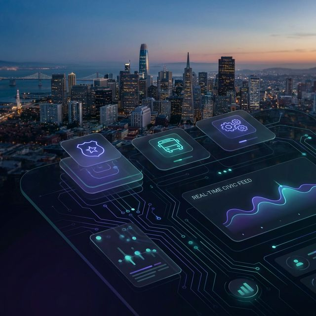

# AI City Council: The Autonomous Engine for Civic Change 🏛️✨



### *Democratizing Civic Power through Agentic Intelligence.*

**AI City Council** is a real-time, multi-agent intelligence platform designed to bridge the gap between San Francisco’s vast Open Data repositories and actionable civic advocacy. For the first time, specialized AI agents act as full-time civic analysts, monitoring government performance, identifying systemic failures, and drafting evidence-based policy recommendations—automatically.

---

## 🌩️ The Problem: The Data Graveyard
San Francisco publishes over **500 datasets** across dozens of departments. However, for most citizens and NGOs, this data is:
- **Inaccessible**: Buried in complex Socrata APIs and spreadsheets.
- **Reactive**: Issues are only noticed after they become headlines.
- **Disconnected**: SFPD data doesn't "talk" to Public Works data, hiding cross-departmental solutions.

## 🚀 The Solution: Autonomous Advocacy
We’ve built a living "Digital Brain" for the city. AI City Council doesn't just display charts; it **understands** the heartbeat of San Francisco.

### 🧠 The Intelligence Layer
- **Marathon Mode**: Agents run in continuous 60-second loops, processing thousands of data points in real-time.
- **Consensus-Driven Analysis**: Distributed agents (Transit, Police, Budget, Public Works) collaborate to identify high-impact issues that require multi-departmental coordination.
- **Actionable Insights**: Unlike traditional dashboards, our agents propose **specific policy solutions** backed by verified evidence citations.

---

## 🛠️ Core Capabilities

### 🚆 Autonomous Monitoring (Marathon Mode)
Specialized agents monitor their domains around the clock. Whether it's a sudden spike in 311 requests or a muni service failure, the council detects it instantly.

### 🏛️ Cross-Agent Collaboration
Our agents "sit" at a virtual council table. The **Budget Agent** notices a funding surplus while the **Public Works Agent** identifies a street maintenance backlog—together, they draft a proposal for immediate reallocation.

### 📝 Verified Civic Action (via Composio)
We've closed the loop between *discovery* and *action*. 
- **Automated Civic Tickets**: High-severity issues are automatically converted into "Civic Tickets" (GitHub Issues) for tracking.
- **AI-Drafted Advocacy**: With a single click, NGO stakeholders can generate professional, data-backed emails to city officials, complete with citations and official contact details.

---

## ⚡ Tech Stack: The Engine Under the Hood

- **Core Intelligence**: [Gemini 2.0 Flash](https://aistudio.google.com/) - Leveraging native reasoning for multi-agent coordination.
- **Action Layer**: [Composio](https://composio.dev/) - Enabling agents to interact with the real world (GitHub, Email, Slack).
- **Contextual Awareness**: [You.com API](https://api.you.com/) - Providing agents with real-time news and policy precedents.
- **Foundation**: Python (FastAPI), React, Tailwind CSS, SSE (Server-Sent Events).

---

## 🏗️ Getting Started

### 1. Initialize the Environment
Clone the repository and install the analytical dependencies:
```bash
pip install -r requirements.txt
```

### 2. Configure Your Keys
Add your credentials to the `.env` file:
```env
GEMINI_API_KEY=your_key
YOU_COM_API_KEY=your_key
COMPOSIO_API_KEY=your_key
```

### 3. Launch the Council
Start the multi-agent backend and real-time dashboard:
```bash
python -m uvicorn backend.main:app --reload
```
Navigate to `http://localhost:8000` to witness the city's data come to life.

---

## 🔮 The Roadmap: Future of the City
- **Predictive Urban Modeling**: Moving from real-time detection to proactive prevention.
- **Citizen Feedback Loops**: Allowing residents to "nudge" agents toward specific neighborhood issues.
- **Multi-City Scaling**: A portable civic brain that can be deployed to any city with an Open Data portal.

*Built with ❤️ for San Francisco. Let's make data-driven advocacy the default.*
